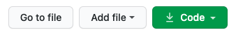
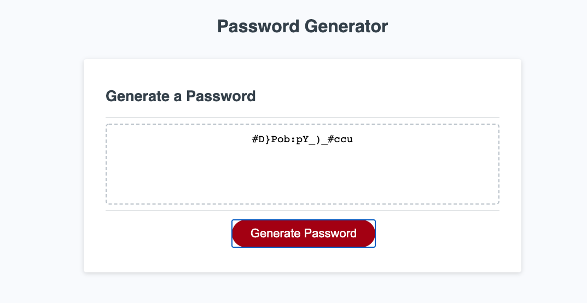

# Password Generator

## Description

This application randomly generates a secure password based on the number of characters requested. [Password Generator](https://derrickhardison.github.io/password-generator/)

## Table of Contents

- [Installation](#installation)
- [Usage](#usage)
- [Credits](#credits)
- [License](#license)

## Installation

This application can be installed here: [Password Generator](https://github.com/derrickhardison/password-generator). It can be downloaded via SSH or as a zip file to your local PC. Additionally, the repository can be forked. See image A-1 for additional help. Please be sure to download all files and keep file structure the same in order to ensure images and styling loads as intended.

Image A-1

## Usage

Click the button to generate a password. You will be presented with a series of prompts for password criteria. When prompted for password criteria, select which criteria to include in the password. When prompted for the length of the password choose a length of at least 8 characters and no more than 128 characters. When prompted for character types to include in the password choose lowercase, uppercase, numeric, and/or special characters. Answer each prompt. When all prompts are answered a password is generated that matches the selected criteria.

Image A-2

## Credits

 A special thanks to the peers from the study sessions who assisted.

## License

MIT License

Copyright (c) [2020] [DerrickHardison]

Permission is hereby granted, free of charge, to any person obtaining a copy
of this software and associated documentation files (the "Software"), to deal
in the Software without restriction, including without limitation the rights
to use, copy, modify, merge, publish, distribute, sublicense, and/or sell
copies of the Software, and to permit persons to whom the Software is
furnished to do so, subject to the following conditions:

The above copyright notice and this permission notice shall be included in all
copies or substantial portions of the Software.

THE SOFTWARE IS PROVIDED "AS IS", WITHOUT WARRANTY OF ANY KIND, EXPRESS OR
IMPLIED, INCLUDING BUT NOT LIMITED TO THE WARRANTIES OF MERCHANTABILITY,
FITNESS FOR A PARTICULAR PURPOSE AND NONINFRINGEMENT. IN NO EVENT SHALL THE
AUTHORS OR COPYRIGHT HOLDERS BE LIABLE FOR ANY CLAIM, DAMAGES OR OTHER
LIABILITY, WHETHER IN AN ACTION OF CONTRACT, TORT OR OTHERWISE, ARISING FROM,
OUT OF OR IN CONNECTION WITH THE SOFTWARE OR THE USE OR OTHER DEALINGS IN THE
SOFTWARE.
